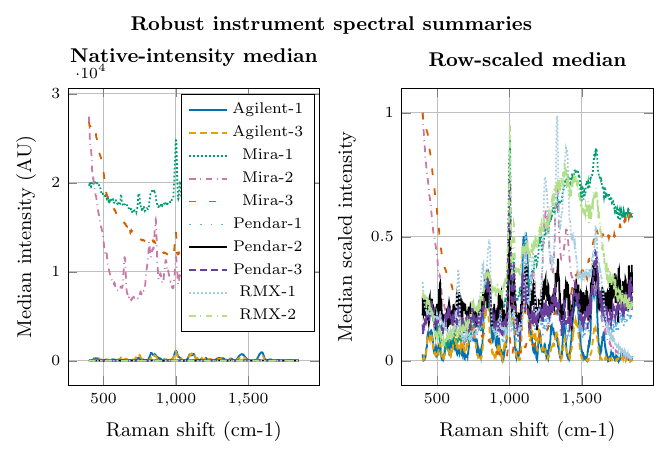
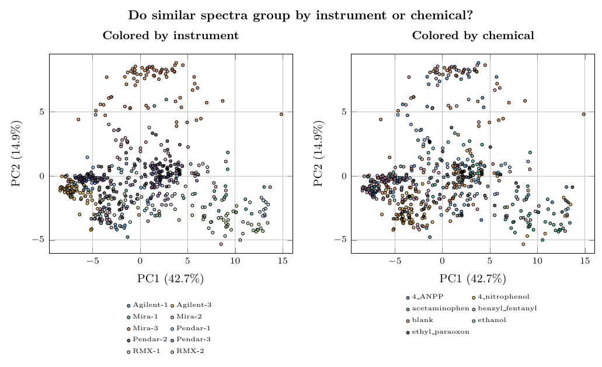
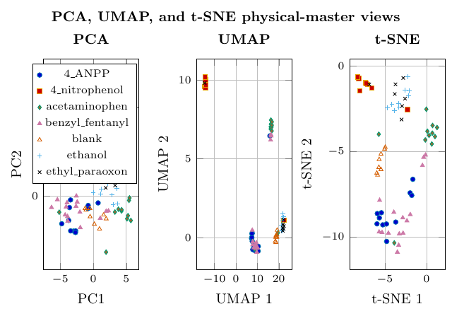
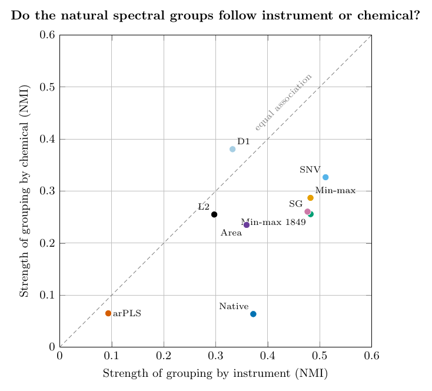

# NATO field-trial SERS research update

I have been organizing and examining the NATO field-trial SERS dataset to determine which research questions it can reliably address. The working dataset has 598 spectra from 69 physical samples, collected using 10 instruments across 7 chemical classes. The main preliminary finding is that spectra still group strongly by instrument after common scaling, which could obscure chemical differences. Background correction helps in some cases but can also remove useful chemical structure.

I am therefore setting up a controlled comparison of preprocessing and classification methods aimed at identifying chemicals on instruments and samples not used during method development. The next step is to define the training and independent test groups in advance, benchmark classical machine-learning methods, and then compare them with deep-learning methods designed to handle instrument differences. Once this workflow is stable, I will begin examining the cell dataset in parallel.

## Research questions

1. Can chemicals be identified on instruments and physical samples not used during training?
2. Which preprocessing best reduces background and noise while preserving useful chemical peaks?
3. Should preprocessing be universal or adapted according to instrument family or measured spectrum quality?
4. Does classical machine learning or deep learning provide better chemical classification on an unseen instrument?
5. How much do a few calibration spectra from a new instrument improve performance?
6. Can the method flag unfamiliar chemicals or unreliable classifications?

## Immediate next step

Freeze the independent training and test groups, benchmark the classical methods, and then evaluate instrument-aware deep-learning approaches under the same conditions.

## Preliminary figures

The figures are descriptive evidence used to define the questions above. They are not classification results.

### 1. Instrument spectral summaries

The instruments produce visibly different intensity scales, backgrounds, and spectral shapes. Scaling makes the curves easier to compare, but does not remove all instrument differences.

[PDF](figures/supervisor_update/pdf/F05_instrument_spectra.pdf) · [Standalone HTML](figures/supervisor_update/html/F05_instrument_spectra.html) · [Native TikZ](figures/supervisor_update/tikz/F05_instrument_spectra.tex)

### 2. Same PCA map, colored by instrument and chemical

PCA places spectra with similar overall shapes near one another. The same points form clearer groups by instrument than by chemical, illustrating the cross-instrument problem.

[PDF](figures/supervisor_update/pdf/S01_pca_recolored.pdf) · [Standalone HTML](figures/supervisor_update/html/S01_pca_recolored.html) · [Native TikZ](figures/supervisor_update/tikz/S01_pca_recolored.tex)

### 3. Three similarity maps of the physical samples

When repeated measurements of each physical sample are combined, useful chemical grouping is still visible. These are exploratory views, not classification performance.

[PDF](figures/supervisor_update/pdf/F08_nonlinear_embeddings.pdf) · [Standalone HTML](figures/supervisor_update/html/F08_nonlinear_embeddings.html) · [Native TikZ](figures/supervisor_update/tikz/F08_nonlinear_embeddings.tex)

### 4. Do the natural groups follow instrument or chemical?

Each point represents one preprocessing method. Points below the diagonal group more strongly by instrument; points above it group more strongly by chemical. Most methods remain instrument-dominated.

[PDF](figures/supervisor_update/pdf/S02_cluster_association_scatter.pdf) · [Standalone HTML](figures/supervisor_update/html/S02_cluster_association_scatter.html) · [Native TikZ](figures/supervisor_update/tikz/S02_cluster_association_scatter.tex)
